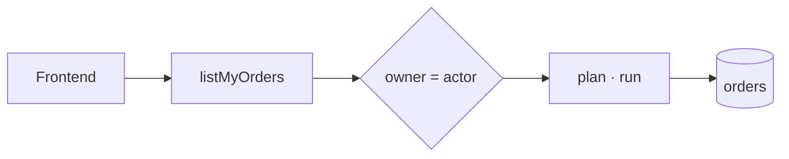

# 12 · 다이어그램·아키텍처 시각화 (AIP)

AIP 의 색은 장식이 아니라 **개념을 가르는 시각 언어**다. 어느 문서의 어느 그림에서도 Intent 는 노랑, Runtime 은 파랑이어야 독자가(그리고 그림을 그리는 AI 가) 범례 없이도 읽는다.

## 1. 문법 세 줄

1. **색 = 개념**(`data-role`). 개념마다 fill·stroke·text 가 고정이다.
2. **모양 = 종류**. 처리 단계는 사각형, 데이터는 원통, 외부 시스템은 점선 사각형, 경계(서버·런타임)는 점선 영역.
3. **선 = 흐름**(`data-edge`). 실선 = 동기 흐름, 점선 = 비동기·외부·거부, 굵은 파랑 = 지금 설명 중인 경로.

## 2. 개념 색

| 개념 `data-role` | 뜻 | 라이트 fill / stroke / text | 근거 |
|---|---|---|---|
| `intent` | 호출자가 선언한 의도 | AIP Yellow / yellow.500 / charcoal | 형광펜 = 가장 먼저 볼 것 |
| `runtime` | AIP Runtime(해석·실행 환경) | blue.50 / AIP Blue / blue.800 | AIP Blue = AIP 자체 |
| `execution` | Runtime 안의 실행 단계 | AIP Blue / blue.700 / white | 같은 파랑의 채움형 |
| `permission` | 서버의 최종 권한 판단·정책 | tangerine.100 / tangerine.500 / tangerine.800 | 탱저린 = 넘지 못하는 경계 |
| `frontend` | 호출자·클라이언트 | slate.50 / slate.500 / slate.800 | |
| `backend` | 서버 정의(계약·정책을 쓰는 곳) | neutral.100 / neutral.600 / neutral.900 | |
| `data` | 데이터 저장소 | AIP Slate / slate.800 / white | 원통 모양 |
| `external` | AIP 경계 밖 시스템 | white / neutral.500 점선 / neutral.700 | |
| `note` | 주석 | yellow.50 / yellow.300 / charcoal | 메모지 |

| 선 `data-edge` | 색 | 모양 |
|---|---|---|
| `default` | neutral.700 | 실선 1.5 |
| `muted` | neutral.500 | 점선(비동기·보조) |
| `emphasis` | AIP Blue | 실선 2 (그림당 경로 하나) |
| `allow` | green.600 | 실선 |
| `reject` | red.600 | 점선 + 라벨("deny · 403") |

경계 영역(AIP Runtime·Server)은 `.aip-svg-zone`: Blue 5% 면 + blue.300 점선 + 모노 대문자 라벨. 다크 값은 `tokens.dark.json`. 노드 글자는 자기 면 위 4.5:1, 테두리·선은 캔버스 위 3:1 을 빌드가 검사한다.

**상태색 규칙**: 빨강·초록은 노드 면에 쓰지 않는다. 노드는 개념, 상태는 선이다.

## 3. 세 가지 그리는 방법

### A. HTML Flow: 한 줄 흐름(가장 간단, 반응형 자동)
```html
<figure class="aip-diagram">
  <div class="aip-diagram__canvas">
    <ol class="aip-flow" aria-label="Request path">
      <li class="aip-node" data-role="intent"><span class="aip-node__kind">intent</span>listMyOrders</li>
      <li class="aip-node" data-role="permission" data-edge="emphasis"><span class="aip-node__kind">permission</span>owner = actor</li>
      <li class="aip-node" data-role="execution" data-edge="allow"><span class="aip-node__kind">execution</span>plan · run</li>
    </ol>
  </div>
  <figcaption class="aip-diagram__caption">…</figcaption>
</figure>
```
순서가 의미라 `<ol>` 이다. md 이상 가로(→), 모바일 세로(↓). 노드의 `data-edge` 가 그 노드로 들어오는 화살표 색을 정한다.

### B. 인라인 SVG: 아키텍처 그림
```html
<div class="aip-diagram__canvas" role="img" aria-labelledby="cap" aria-describedby="desc" tabindex="0">
  <svg viewBox="0 0 760 300" style="--aip-_min: 640px" aria-hidden="true">
    <defs><marker id="ah-reject" data-edge="reject" …><path d="M0 0 L10 5 L0 10 z"/></marker></defs>
    <rect class="aip-svg-zone" …/><text class="aip-svg-zone-label" …>AIP RUNTIME</text>
    <g data-role="permission"><rect …/><text …>Permission</text><text class="aip-svg-meta" …>policy</text></g>
    <path data-edge="reject" d="…" marker-end="url(#ah-reject)"/>
    <rect class="aip-svg-label-bg" …/><text class="aip-svg-label" …>deny · 403</text>
  </svg>
</div>
```
좌표·모양은 그림이 정하고, 색·선 굵기·글꼴은 `data-role`·`data-edge`·클래스가 토큰으로 칠한다. SVG 안에 hex 를 쓰지 않는다. 화살촉은 선 종류마다 `marker[data-edge]` 하나씩 둔다. 좁은 화면에서는 `--aip-_min` 폭을 지키고 캔버스가 가로로 스크롤된다(`tabindex="0"`). 전체 예: `examples/docs.html` Figure 1.

### C. Mermaid: 문서 작성자·AI 가 텍스트로
`dist/diagram.mermaid.json` 에 라이트·다크 `themeVariables` 와 개념별 `classDefs`·`linkStyles` 가 있다(토큰에서 생성). 렌더러 초기화에 테마를 넣고 그림 끝에 classDef 를 붙인다.


Mermaid 는 CSS 변수를 읽지 못해서 테마 전환 때 다시 렌더해야 한다. 정적 문서(README·PR)는 라이트 값을 쓴다.

## 4. 컨테이너

`figure.aip-diagram` = `.aip-diagram__canvas`(점 격자 바탕 `diagram.canvas`, 테두리, radius 8, 패딩 24) + `figcaption.aip-diagram__caption`("**Figure 1.** 한 문장") + `ul.aip-diagram__legend`(쓴 개념만) + `details.aip-diagram__text`(텍스트 설명).

## 5. 접근성: 그림만으로 말하지 않는다

- SVG 캔버스는 `role="img"` + `aria-labelledby`(캡션) + `aria-describedby`(텍스트 설명). SVG 자체는 `aria-hidden`.
- HTML Flow 는 목록 자체가 텍스트라 추가 설명이 없어도 된다.
- 텍스트 설명은 번호 목록으로 흐름을 그대로 적는다. AI 에이전트는 이 목록을 읽는다.
- 노드에는 항상 라벨이 있다. 색만 있는 노드는 없다.

## 6. 그림 규칙

| 규칙 | 이유 |
|---|---|
| 개념 색은 그림당 다섯 종류까지 | 그 이상이면 그림을 나눈다 |
| 강조 경로(`emphasis`)는 하나 | 둘이면 아무것도 강조되지 않는다 |
| 흐름은 왼쪽→오른쪽, 위→아래 | 읽는 순서와 같게 |
| 선은 직각 꺾임(원호·대각선 금지) | 회로도처럼 정확하게 |
| 노드 라벨은 이름, 아래 줄은 종류·세부(`aip-svg-meta`, 모노) | |
| 같은 개념은 같은 단어(문서 용어집과 일치) | |
| 아이콘을 노드에 넣지 않는다 | 모양·색·라벨로 충분하다 |
